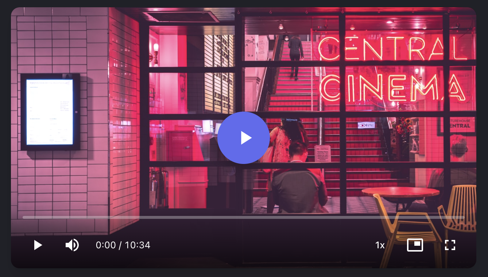
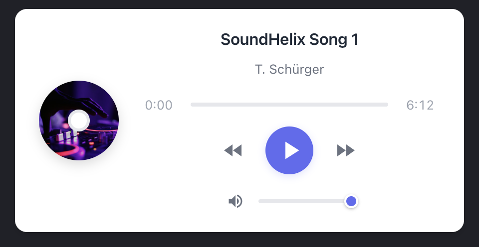
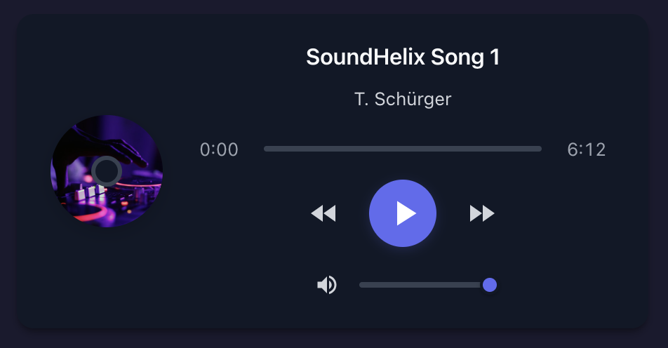

# Vue3 Media 🎬

[](https://www.npmjs.com/package/@peakchao/vue3-media)
[](https://vuejs.org/)
[](https://www.typescriptlang.org/)
[](https://opensource.org/licenses/MIT)

[中文](./README.zh-CN.md) | English

A beautiful, feature-rich media player component library for Vue 3. Includes customizable Video and Audio players with modern UI, dark mode support, and full TypeScript integration.

📚 **[Documentation](https://zhangzhichaolove.github.io/vue3-media/en/)**

## 📷 Preview

### Video Player


### Audio Player
| Light Mode | Dark Mode |
|:----------:|:---------:|
|  |  |

## ✨ Features

- 🎥 **Video Player** - Full-featured video player with custom controls, Picture-in-Picture, and mini player
- 🎵 **Audio Player** - Beautiful audio player with album art support
- 🌙 **Dark Mode** - Built-in dark mode support
- 🎨 **Customizable** - Easily customize primary color and themes
- 📱 **Responsive** - Mobile-friendly design with touch gestures
- ⌨️ **Keyboard Shortcuts** - Full keyboard control support
- ♿ **Accessible** - Screen reader friendly
- 🔧 **TypeScript** - Complete type definitions included
- ⚡ **Lightweight** - No external dependencies

## 📦 Installation

```bash
# npm
npm install @peakchao/vue3-media

# yarn
yarn add @peakchao/vue3-media

# pnpm
pnpm add @peakchao/vue3-media
```

## 🚀 Quick Start

### Import Styles

```ts
// main.ts
import '@peakchao/vue3-media/style'
```

### Use Components

```vue
<script setup>
import { VideoPlayer, AudioPlayer } from '@peakchao/vue3-media'
</script>

<template>
  <!-- Video Player -->
  <VideoPlayer
    src="https://example.com/video.mp4"
    poster="https://example.com/poster.jpg"
  />

  <!-- Audio Player -->
  <AudioPlayer
    src="https://example.com/audio.mp3"
    title="Song Title"
    artist="Artist Name"
    cover="https://example.com/cover.jpg"
  />
</template>
```

### Global Registration (Optional)

```ts
import { createApp } from 'vue'
import Vue3Media from '@peakchao/vue3-media'
import '@peakchao/vue3-media/style'

const app = createApp(App)
app.use(Vue3Media)
app.mount('#app')
```

## 📹 VideoPlayer

A modern video player with all the controls you need.

### Props

| Prop | Type | Default | Description |
|------|------|---------|-------------|
| `src` | `string` | *required* | Video source URL |
| `poster` | `string` | - | Poster image URL |
| `autoplay` | `boolean` | `false` | Auto-play video on load |
| `loop` | `boolean` | `false` | Loop video playback |
| `muted` | `boolean` | `false` | Mute video by default |
| `controls` | `boolean` | `true` | Show player controls |
| `primaryColor` | `string` | `'#6366f1'` | Theme primary color |
| `darkMode` | `boolean` | `false` | Enable dark mode |
| `keyboardShortcuts` | `boolean` | `true` | Enable keyboard shortcuts |
| `showPiP` | `boolean` | `true` | Show Picture-in-Picture button |
| `miniPlayer` | `boolean` | `false` | Enable mini player mode |

### Keyboard Shortcuts

| Key | Action |
|-----|--------|
| `Space` | Play/Pause |
| `←` / `→` | Seek ±5 seconds |
| `↑` / `↓` | Volume ±10% |
| `M` | Mute/Unmute |
| `F` | Toggle Fullscreen |

## 🎵 AudioPlayer

An elegant audio player with cover art and track info display.

### Props

| Prop | Type | Default | Description |
|------|------|---------|-------------|
| `src` | `string` | *required* | Audio source URL |
| `title` | `string` | - | Track title |
| `artist` | `string` | - | Artist name |
| `cover` | `string` | - | Cover image URL |
| `primaryColor` | `string` | `'#6366f1'` | Theme primary color |
| `darkMode` | `boolean` | `false` | Enable dark mode |

## 🎨 Theming

```vue
<template>
  <!-- Custom theme with dark mode -->
  <VideoPlayer
    src="video.mp4"
    primaryColor="#8b5cf6"
    :darkMode="true"
  />
</template>
```

## 📄 License

MIT License © 2025 [peakchao](https://github.com/zhangzhichaolove)
